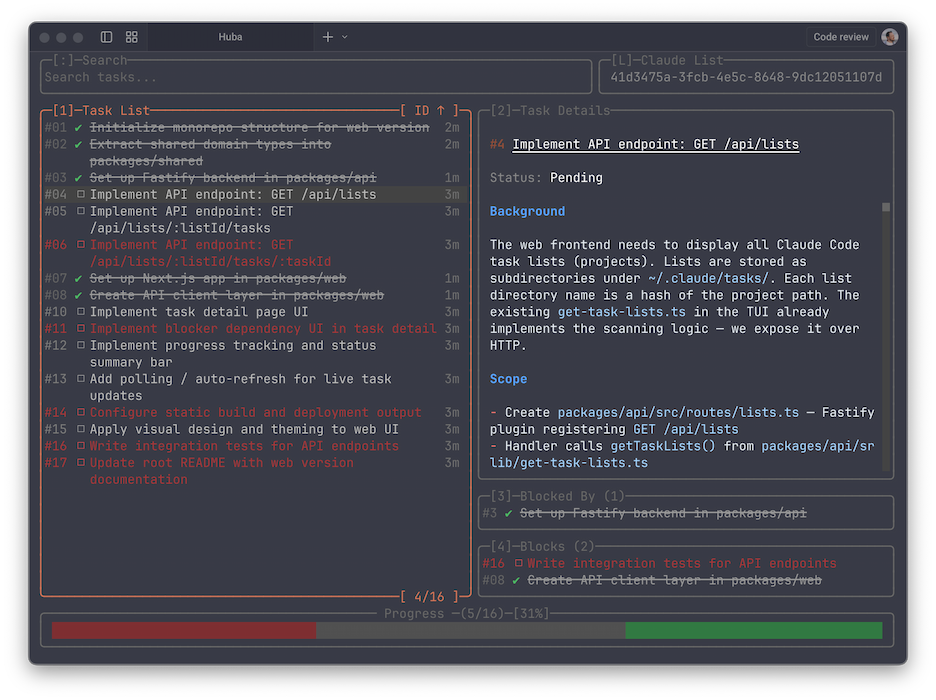

# Huba

> Your tasks deserve a better UI than `cat todo.json`.

Huba is a slick tool for managing [Claude Code](https://code.claude.com/docs/en/interactive-mode#task-list) tasks — search, view, create, edit, and delete tasks across all your projects without leaving the terminal.

The name `huba` is derived from `hullaballoo`, reflecting the beautiful chaos that happens when you're vibing with AI agents and shipping code at the speed of thought.

<p align="center"></p>

## Why Huba?

In agentic development, you craft the context, the agent delivers. Tasks are an essential part of agentic development, managing the context effectively and achieving excellent outcomes.

While there are third-party tools available to integrate into your agentic workflows for task management, the [native tasks from Claude Code](https://code.claude.com/docs/en/interactive-mode#task-list) provide a seamless and slick task management experience for the agent, making it more efficient.

[Claude Code's native task list](https://code.claude.com/docs/en/interactive-mode#task-list) is great for the agent, but let's be honest — as a human, you deserve more than just task names in a flat list.

Huba gives you the full picture: browse your tasks in a beautiful terminal UI, review descriptions, track dependencies, filter by status, and shape your task list into something that actually drives results.

## Features

- **Live reload** — file watchers pick up changes instantly when Claude Code updates tasks
- **Multi-project** — browse task lists across all your Claude Code projects
- **Filter & sort** — slice through tasks by status, keywords, whatever you need
- **Dependency graph** — see what blocks what at a glance
- **Keyboard-first** — fully navigable without touching the mouse
- **Themeable** — ships with multiple themes, or bring your own

## Development Guide

```bash
# Install dependencies
bun install

# Start in dev mode
bun run dev

# Or open a specific task list directly
CLAUDE_CODE_TASK_LIST_ID=abc123 bun run dev
```

### Prerequisites

- [Bun](https://bun.sh/) runtime installed

### Commands

| Command | What it does |
|---|---|
| `bun run dev` | Run the app in dev mode |
| `bun run dev:watch` | Run with auto-reload on file changes |
| `bun run typecheck` | Type-check with TypeScript |
| `bun run format` | Check formatting & linting (Biome) |
| `bun run lint` | Lint the codebase |
| `bun test` | Run tests |

### Tech Stack

- **Bun** — runtime, package manager, bundler, all-in-one
- **TypeScript** — 100% typed, no `any` allowed
- **OpenTUI** — React reconciler for terminal UIs
- **Jotai** — atomic state management
- **TanStack Query** — async state & caching
- **Zod** — runtime schema validation
- **Biome** — formatting & linting

---

Made with ❤️ by [Sergey Zwezdin](https://github.com/sergeyzwezdin)
